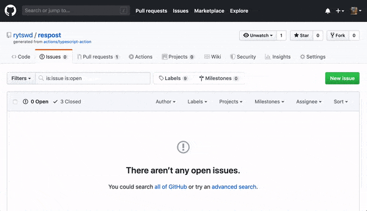

# Respost - Response Post

## **WHAT**: Send Response from GitHub Actions

Simple HTTP POST to write to the Issue and PR.

## **HOW**: Example - Issue Creation + Bot-like Response



> **WARNING**: I have edited the above recording, it was originally around 90 sec.  
> **NOTE**: [`comvent`](http://github.com/rytswd/comvent) is used to provide bot-like comment parsing.

## **HOW**: Example - Above, with YAML

```yaml
name: Respost - Write comment to new Issue event
on: issues

jobs:
  comment:
    runs-on: ubuntu-latest
    steps:
      - uses: rytswd/respost@v0.1.0
        with:
          title: Respost Custom Title from step 1, for Issue
          body: "Hello, World! Respost is here, making your GitHub Actions workflow even easier!"
        env:
          GITHUB_TOKEN: ${{ secrets.GITHUB_TOKEN }}
```

This is all you need to automatically drop a comment when a new issue is created.

You can find more examples in this repo's [`.github/workflows/`](.github/workflows/).

## **WHY**: Simple and Cheap

GitHub Actions can be defined either in JavaScript or Docker container.

Docker container allows full segregation and secure setup, but it takes about ~10sec to build and start up.  
When you wish to use GitHub Actions on frequently used events such as PR and Issue Comments, this can easily add up.

TypeScript can work seamlessly with JSON object, and [axios](github.com/axios/axios) provides easy HTTP POST handling.
